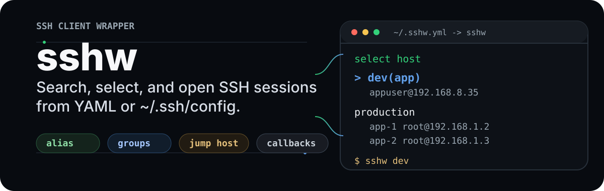

# sshw

<p align="center">
  
</p>

<p align="center">
  <a href="https://github.com/yinheli/sshw/releases"></a>
  <a href="./LICENSE"></a>
  <a href="https://pkg.go.dev/github.com/yinheli/sshw"></a>
</p>

<p align="center">
  <a href="./README.md">English</a> | <a href="./README.ja.md">日本語</a> | 한국어 | <a href="./README.vi.md">Tiếng Việt</a> | <a href="./README.zh-CN.md">简体中文</a>
</p>

`sshw`는 여러 서버를 오가는 사용자를 위한 작은 SSH 클라이언트 래퍼입니다. 호스트를 YAML에 한 번 정의하면, 검색 가능한 터미널 메뉴에서 대상을 고르고 사용자, 포트, 키, 비밀번호, SSH agent, 점프 호스트, 선택적인 시작 후 명령으로 세션을 열 수 있습니다.


## 사용하는 이유

- 긴 `ssh` 명령을 입력하지 않고 대화형 터미널 선택기에서 SSH 대상을 탐색할 수 있습니다.
- `sshw -search <keyword>`로 중첩된 호스트 그룹 전체를 검색할 수 있습니다.
- `sshw -config`로 로컬 웹 UI에서 `~/.sshw.yaml`을 설정할 수 있습니다.
- 예를 들어 `sshw dev`처럼 별칭으로 바로 연결할 수 있습니다.
- 팀, 환경, 네트워크 구간별로 호스트를 중첩 그룹으로 정리할 수 있습니다.
- 비밀번호, 키 파일, 패스프레이즈가 있는 키, SSH agent, keyboard-interactive 인증을 지원합니다.
- 설정된 점프 호스트를 거쳐 연결할 수 있습니다.
- `sshw -s`로 `~/.ssh/config`의 항목을 가져올 수 있습니다.
- 원격 shell이 열린 뒤 선택적인 콜백 명령을 실행할 수 있습니다.

## 설치

Go로 최신 버전을 설치합니다.

```bash
go install github.com/yinheli/sshw/cmd/sshw@latest
```

현재 소스를 빌드합니다.

```bash
./build.sh
```

바이너리는 `dist/<os>-<arch>/sshw`에 생성됩니다. `GOOS`, `GOARCH`,
`VERSION`, `OUTPUT_DIR`로 대상, 버전, 출력 디렉터리를 지정할 수 있습니다.

```bash
GOOS=linux GOARCH=amd64 VERSION=dev ./build.sh
```

사전 빌드된 바이너리는 [GitHub Releases](https://github.com/yinheli/sshw/releases)에서도 다운로드할 수 있습니다.

## 처음 실행하기

설정 파일을 만듭니다.

```bash
touch ~/.sshw.yml
```

호스트를 하나 이상 추가합니다.

```yaml
- name: dev
  alias: dev
  host: 192.168.8.35
  user: appuser
  port: 22
  keypath: ~/.ssh/id_rsa
```

선택기를 엽니다.

```bash
sshw
```

또는 별칭으로 연결합니다.

```bash
sshw dev
```

모든 호스트를 대화형으로 검색합니다. 초기 키워드는 편집할 수 있으며 문자를 삭제하면 필터링되었던 호스트가 다시 표시됩니다.

```bash
sshw -search
sshw -search dev
```

`~/.sshw.yaml`용 로컬 웹 설정 편집기를 시작합니다.

```bash
sshw -config
```

## 설정

`sshw`는 다음 순서로 처음 발견한 설정 파일을 읽습니다.

1. `~/.sshw`
2. `~/.sshw.yml`
3. `~/.sshw.yaml`
4. `./.sshw`
5. `./.sshw.yml`
6. `./.sshw.yaml`

로컬 웹 UI에서 `~/.sshw.yaml`을 만들거나 업데이트하려면 다음을 실행합니다.

```bash
sshw -config
```

편집기는 기본 브라우저에서 로컬 URL을 열고 터미널에도 주소를 출력합니다. 기본적으로 `127.0.0.1`에서만 수신합니다. 호스트와 그룹을 추가, 편집, 삭제, 저장할 수 있고 일반 호스트 필드, 점프 호스트 1개, 콜백 명령, 중첩 그룹, 빈 그룹을 지원합니다. 브라우저를 열 수 없어도 서버는 계속 실행되므로 출력된 URL을 직접 열 수 있습니다. 다른 파일을 편집하려면 `-config-file`을 전달합니다.

```bash
sshw -config -config-file ./.sshw.yaml
```

다른 로컬 바인드 주소를 사용하려면 다음을 지정합니다.

```bash
sshw -config -config-addr 127.0.0.1:9000
```

각 항목은 호스트 또는 그룹일 수 있습니다. 호스트 필드는 다음과 같습니다.

| 필드 | 설명 |
| --- | --- |
| `name` | 선택기에 표시되는 이름입니다. |
| `alias` | `sshw <alias>`에서 사용하는 선택적 바로가기입니다. |
| `host` | 호스트 이름 또는 IP 주소입니다. |
| `user` | SSH 사용자 이름입니다. 생략하면 `root`를 사용합니다. |
| `port` | SSH 포트입니다. 생략하면 `22`를 사용합니다. |
| `password` | 비밀번호 인증 값입니다. |
| `keypath` | 개인 키 경로입니다. `~`가 확장됩니다. |
| `passphrase` | 설정된 키의 패스프레이즈입니다. |
| `agentpath` | SSH agent 소켓 경로입니다. |
| `jump` | 점프 호스트 정의입니다. |
| `children` | 중첩된 호스트 또는 그룹입니다. |
| `callback-shells` | shell 시작 후 전송할 명령입니다. |

## 예시

### 일반 호스트

```yaml
- { name: dev with password, alias: dev, user: appuser, host: 192.168.8.35, port: 22, password: 123456 }
- { name: dev with key, user: appuser, host: 192.168.8.35, keypath: ~/.ssh/id_rsa }
- { name: default root and port, host: 192.168.8.35 }
- { name: "emoji host", alias: spark, host: 192.168.8.35 }
```

### 점프 호스트

```yaml
- name: app via bastion
  alias: app
  user: appuser
  host: 192.168.8.35
  port: 22
  keypath: ~/.ssh/id_rsa
  jump:
    - user: appuser
      host: 192.168.8.36
      port: 2222
      keypath: ~/.ssh/bastion_rsa
```

### 그룹

```yaml
- name: production
  children:
    - { name: app-1, user: root, host: 192.168.1.2 }
    - { name: app-2, user: root, host: 192.168.1.3 }
    - { name: app-3, user: root, host: 192.168.1.4 }
```

### 콜백 명령

`callback-shells`는 로그인 후 원격 shell로 명령을 보냅니다. `delay` 단위는 밀리초입니다.

```yaml
- name: dev with startup commands
  alias: dev
  user: appuser
  host: 192.168.8.35
  keypath: ~/.ssh/id_rsa
  callback-shells:
    - { cmd: "cd /srv/app" }
    - { delay: 1500, cmd: "docker ps" }
```

## `~/.ssh/config` 사용하기

`.sshw.yml` 대신 로컬 SSH config에서 선택기를 만들려면 다음을 실행합니다.

```bash
sshw -s
```

`sshw`는 `~/.ssh/config`에서 `Host`, `HostName`, `User`, `Port`, `IdentityFile`, `IdentityAgent`를 읽습니다.

## 명령

```text
sshw             대화형 선택기를 엽니다
sshw <alias>     설정된 별칭으로 연결합니다
sshw -s          ~/.ssh/config에서 항목을 읽습니다
sshw -search [keyword] 이름, 별칭, 사용자, 호스트, 포트로 대화형 검색
sshw -q [keyword] -search의 단축 옵션
sshw -config     로컬 웹 UI에서 ~/.sshw.yaml을 편집합니다
sshw -c          -config의 단축 옵션
sshw -version    빌드 버전과 Go 버전을 출력합니다
sshw -v          -version의 단축 옵션
sshw -help       플래그를 표시합니다
sshw -h          -help의 단축 옵션
```

## 참고

- 실제 비밀번호, 개인 키, 프로덕션 호스트 정보를 공개 저장소에 커밋하지 마세요.
- `user`를 생략하면 `sshw`는 `root`를 사용합니다.
- `port`를 생략하면 `sshw`는 `22`를 사용합니다.
- 점프 호스트 지원은 현재 설정의 첫 번째 `jump` 항목을 사용합니다.

## 라이선스

[MIT](./LICENSE)
